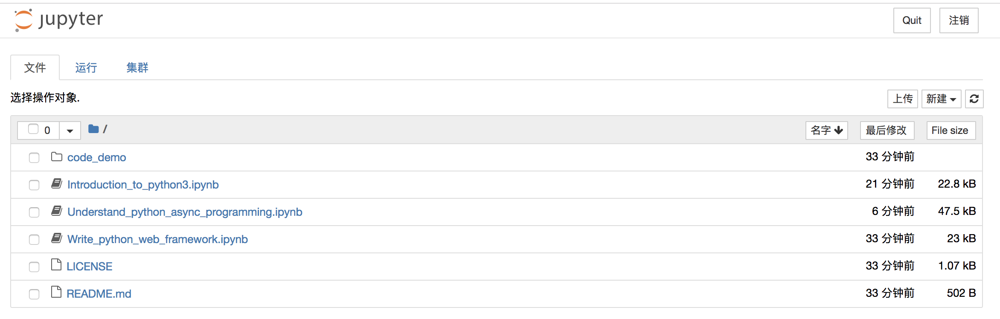
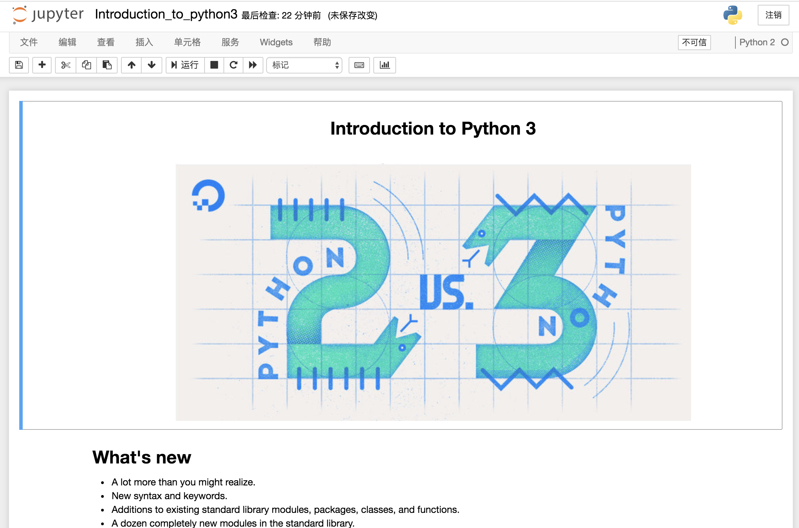

# notebooks

My jupyter notebooks

用使 RISE 制作的 notebooks 演讲稿。你可以用 jupyter 打开 ipynb 文件来查看。

# usage

```
python3 -m pip install jupyter    # or python -m pip install jupyter

pip install RISE    # https://github.com/damianavila/RISE
jupyter-nbextension install rise --py --sys-prefix
jupyter-nbextension enable rise --py --sys-prefix

jupyter notebook    # 换到切项目根目录下执行
```

# demo:




