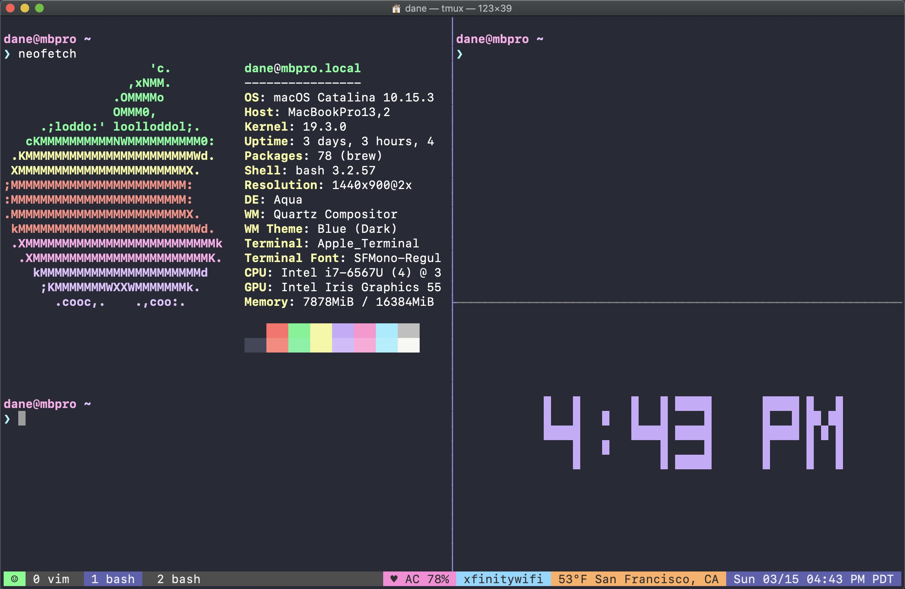

---
# try also 'default' to start simple
theme: seriph
# random image from a curated Unsplash collection by Anthony
# like them? see https://unsplash.com/collections/94734566/slidev
#background: https://source.unsplash.com/collection/94734566/1920x1080
background: https://images.unsplash.com/photo-1556075798-4825dfaaf498?ixlib=rb-1.2.1&ixid=MnwxMjA3fDB8MHxwaG90by1wYWdlfHx8fGVufDB8fHx8&auto=format&fit=crop&w=1176&q=80
# apply any windi css classes to the current slide
class: 'text-center'
# https://sli.dev/custom/highlighters.html
highlighter: shiki
# some information about the slides, markdown enabled
info: |
  ## Slidev Starter Template
  Presentation slides for developers.

  Learn more at [Sli.dev](https://sli.dev)
---

# Welcome to Tmux

  
    Press Space for next page <carbon:arrow-right class="inline"/>
  

<a href="https://github.com/slidevjs/slidev" target="_blank" alt="GitHub"
  class="abs-br m-6 text-xl icon-btn opacity-50 !border-none !hover:text-white">
  <carbon-logo-github />
</a>

<!--
The last comment block of each slide will be treated as slide notes. It will be visible and editable in Presenter Mode along with the slide. [Read more in the docs](https://sli.dev/guide/syntax.html#notes)
-->

---

# 天天和服务器打交道，有哪些痛点？

- 无法保存会话。每次登上服务器/容器之前的工作内容都丢失了
- 无法托管进程。运行一个程序脚本之类的一旦断开连接就会被 kill 掉
- 工作重复。每次进入服务器都要重新找到之前的代码目录切入工作
- 无法多窗口，或者每开一个窗口都要重新登录
- 。。。

---

# 终端复用神器 Tmux 横空出世

- 会话保持。每次进入服务器直接恢复工作内容，so easy !
- 进程托管。运行脚本再也不用担心被杀掉了
- 窗口分割。多个窗口想怎么搞就怎么搞
- 终端复用。直接新建窗口、窗格，再也不用重新登录服务器啦
- 全键盘操作，解放双手
- 有了 tmux，你在服务器/容器上的工作内容再也不会丢失了，登录就可以恢复

---

# 终端复用 Tmux
Tmux 的主要概念就是会话、窗口和窗格。
- 会话(session)。可以长期保持，每次登录的时候恢复，从而保留你的工作不会丢失
- 窗口(window)。一个会话可以多个窗口，用来组织不同的工作
- 窗格(pane)。一个窗口又可以分割为多个窗格，方便多线程工作

 
 

---

# 会话操作

### 会话快捷键 (默认前缀prefix是ctrl+b)

|                             |                        |
|-----------------------------|------------------------|
| <kbd>tmux</kbd>             | 创建一个新会话         |
| <kbd>tmux new -s name</kbd> | 创建一个命名会话       |
| <kbd>tmux a -t name</kbd>   | 连接(attach)到一个会话 |
| <kbd>tmux d</kbd>           | 从会话分离(deattach)   |
| <kbd>tmux ls</kbd>          | 列举会话               |
| <kbd>prefix + s</kbd>       | 列举会话用于切换       |

---

# 窗口操作

### 窗口快捷键 (默认前缀prefix是ctrl+b)

|                       |                |
|-----------------------|----------------|
| <kbd>prefix + c</kbd> | 创建一个新窗口 |
| <kbd>prefix + n</kbd> | 切到下一个窗口 |
| <kbd>prefix + p</kbd> | 切到上一个窗口 |

---

# 窗格操作

### 窗格快捷键 (默认前缀prefix是ctrl+b)

|                       |                |
|-----------------------|----------------|
| <kbd>prefix + %</kbd> | 竖分屏|
| <kbd>prefix + "</kbd> | 横分屏 |
| <kbd>prefix + o</kbd> | 切到下一个窗格 |

---

# 一个简单的 Tmux 工作流

命令太多记不住？ 一个简单的工作流其实只需要记住几个命令就可以！

- `tmux new -s XXX` 新建一个会话，一般用自己的项目命名
- `prefix + "` 分割窗口进行工作。`prefix+o` 在窗口之间切换
- 下班了活干完啦? 直接 `prefix + d` 分离会话，哪怕直接关掉终端也不用担心工作丢失
- 继续干活，ssh 到服务器/容器。然后 `tmux a -t XXX` 你之前的目录、脚本、日志等工作内容都就回来了！

---

# 进阶功能

- 配置文件修改状态栏、快捷键等
- 安装插件、自动保存和恢复会话

---
layout: center
class: text-center
---

# Learn More

[Documentations](https://sli.dev) / [GitHub Repo](https://github.com/slidevjs/slidev)
